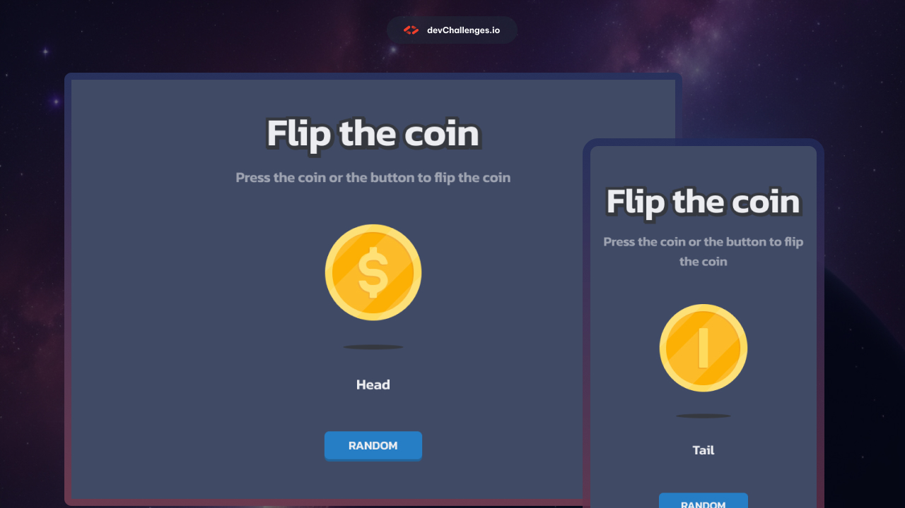

# DevChallenges.io - Lanza la Moneda

## ¡Bienvenido! 👋

Bienvenido a este desafío de codificación web responsiva.

Los desafíos de [devChallenges.io](https://devchallenges.io/) están diseñados para ayudarte a mejorar tus habilidades de codificación construyendo proyectos realistas.

## El desafío

Tu tarea es crear una página web que se asemeje lo más posible al diseño proporcionado.

Puedes usar cualquier herramienta o recurso que desees para completar este desafío. Cada desafío está diseñado para practicar diferentes habilidades, así que asegúrate de revisar la descripción del desafío para obtener más información.

Si necesitas ayuda o tienes alguna pregunta, no dudes en [unirte a nuestra comunidad](https://github.com/orgs/devchallenges-io/discussions) y pedir apoyo.

## Dónde encontrar todo

Tu objetivo es construir el proyecto utilizando el diseño proporcionado. Puedes encontrar los diseños en el editor del desafío una vez que comiences el desafío o en la carpeta `/design`. Ten en cuenta que la carpeta `/design` puede no incluir todos los diseños que necesitas, así que asegúrate de revisar el editor para más detalles.

Los diseños están en formato JPG, por lo que deberás usar tu mejor criterio para estilos como `font-size`, `padding` y `margin`. Además, las guías de espaciado están disponibles para cada desafío, pero el acceso a ellas requiere una [membresía Pro](https://devchallenges.io/pro). Con una membresía Pro, también puedes descargar los archivos de diseño en Figma.

Todos los recursos necesarios se pueden encontrar en la carpeta `/resources`. Es posible que necesites optimizar los recursos según sea necesario.

Para obtener más información sobre el desafío, accede al editor del desafío en [devChallenges.io](https://devchallenges.io/challenges-dashboard).

## Pasos para completar el desafío en devChallenges.io

- [ ] Comienza visitando [devChallenges.io](https://devchallenges.io/), navega a la página del desafío y comienza el desafío.
- [ ] Una vez que hayas comenzado el desafío, tendrás acceso al editor donde puedes descargar los recursos necesarios, verificar colores, fuentes y más.
- [ ] Descarga los recursos iniciales, y si eres usuario Pro, también puedes descargar el archivo de Figma.
- [ ] Inicializa el proyecto como un repositorio Git.
- [ ] Revisa el diseño y analiza las diferentes versiones para escritorio, tablet y móvil.
- [ ] Planifica tu enfoque para el proyecto identificando clases CSS reutilizables y estructurando tu contenido HTML.
- [ ] Define los estilos base para tu proyecto, incluyendo `font-family`, `font-size` y otros estilos generales de contenido.
- [ ] Comienza a agregar estilos desde la parte superior de la página y trabaja hacia abajo, asegurándote de que cada sección sea visualmente atractiva y coincida con el diseño proporcionado.
- [ ] Optimiza y redimensiona los recursos necesarios de la carpeta `/images` según sea necesario.
- [ ] Prueba la capacidad de respuesta de tu proyecto previsualizándolo en diferentes dispositivos y tamaños de pantalla.
- [ ] Una vez que estés satisfecho con tu implementación, despliega tu proyecto en una plataforma de alojamiento como GitHub Pages, Vercel o Netlify.
- [ ] Envía tu solución en devChallenges.io y apunta a pasar las pruebas de comparación de diseño y rendimiento.
- [ ] Reemplaza el archivo `README.md` predeterminado con uno personalizado que explique tu proyecto y refleje tu experiencia de aprendizaje. Puedes usar el archivo `README-template.md` proporcionado como punto de partida.
- [ ] Comparte tu solución con la comunidad de devChallenges.io tuiteando a [@devchallengesio](https://twitter.com/devchallengesio) y mencionando los enlaces del repositorio y la URL en vivo en tu tweet. También puedes compartir tu solución en otros canales sociales o escribir una publicación de blog sobre tu experiencia.
- [ ] Busca retroalimentación de la comunidad utilizando las plantillas proporcionadas o haciendo preguntas específicas sobre tu implementación.

¡Buena suerte y disfruta construyendo tu proyecto! 🚀

## Desplegando tu proyecto

Nuestras opciones de alojamiento recomendadas incluyen:

- [GitHub Pages](https://pages.github.com/)
- [Vercel](https://vercel.com/)
- [Netlify](https://www.netlify.com/)

Puedes elegir cualquiera de estas soluciones o explorar otros proveedores confiables. Para más información, consulta nuestra guía sobre [plataformas de alojamiento gratuitas](https://devchallenges.io/learn/1-fundamentals/free-hosting-for-web-projects).

## Crea tu propio `README.md`

Para usar la plantilla de Readme, sigue estos pasos:

1. Abre el archivo `README-template.md` en tu editor de texto.
2. Reemplaza el contenido de marcador de posición con la información de tu proyecto.
3. Personaliza las secciones y encabezados para que se ajusten a las necesidades de tu proyecto.
4. Agrega una descripción detallada de tu proyecto, incluyendo su propósito y características.
5. Reflexiona sobre tu experiencia de aprendizaje y cualquier desafío que hayas encontrado durante el desarrollo.
6. Elimina el archivo `README.md` original.
7. Renombra el archivo `README-template.md` a `README.md`.
8. Guarda los cambios y confirma el archivo `README.md` actualizado en tu repositorio.

Siguiendo estas instrucciones, puedes crear un archivo `README.md` personalizado que comunique efectivamente tu proyecto a otros.

## Más guías

No olvides revisar el [Currículum de devChallenges](https://devchallenges.io/learn), que cubre temas básicos y avanzados esenciales para tu viaje en el desarrollo web.

## Compartiendo tu solución

Hay varias plataformas donde puedes compartir tu solución:

1. Tuitea a [@devchallengesio](https://x.com/devchallengesio) y menciona **@devchallengesio**, incluyendo los enlaces del repositorio y la URL en vivo en tu tweet. Nos encantaría ver lo que has construido y ayudar a difundirlo.
2. Comparte tu solución en otros canales sociales como LinkedIn y etiqueta a [devchallenges](https://www.linkedin.com/company/devchallenges).
3. Escribe una publicación de blog sobre tu experiencia construyendo el proyecto. Documentar tu flujo de trabajo, elecciones técnicas y explicar tu código es una excelente manera de reforzar tu aprendizaje. Las plataformas populares para escribir incluyen [dev.to](https://dev.to/), [Hashnode](https://hashnode.com/) y [CodeNewbie](https://community.codenewbie.org/).

Proporcionamos plantillas para ayudarte a compartir tu solución una vez que la hayas enviado en la plataforma. Siéntete libre de editarlas e incluir preguntas específicas al buscar retroalimentación.

Cuanto más específicas sean tus preguntas, más probable será que otro miembro de la comunidad proporcione retroalimentación.

## Retroalimentación

Valoramos la retroalimentación y siempre buscamos mejorar nuestros desafíos y plataforma. Si tienes alguna sugerencia o comentario, envíanos un correo electrónico a hi\[at]devchallenges\[dot]io.

Este desafío es completamente gratuito. Por favor, compártelo con cualquier persona que lo encuentre útil para practicar.

**¡Disfruta construyendo!** 🚀
